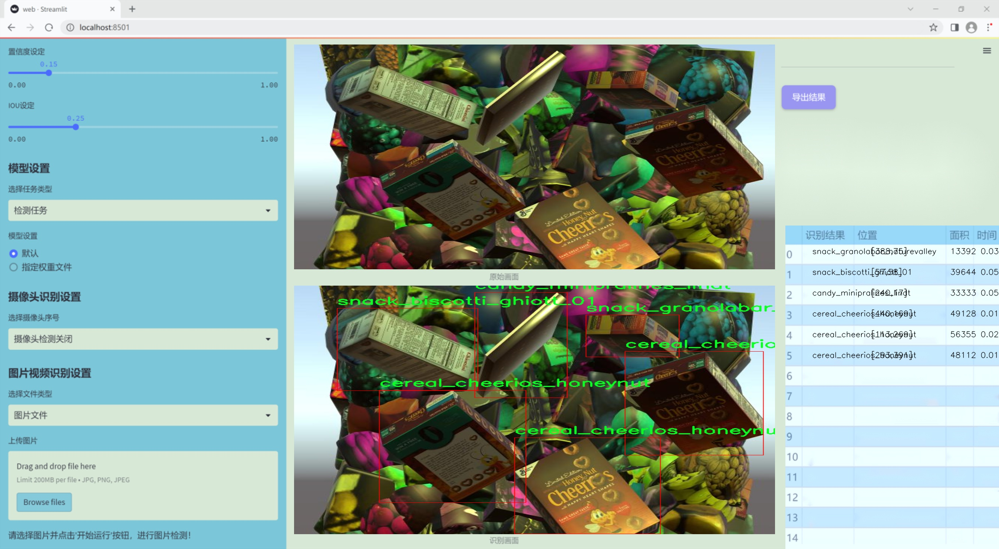

# 改进yolo11-dysample等200+全套创新点大全：超市购物车商品检测系统源码＆数据集全套

### 1.图片效果展示




##### 项目来源 **[人工智能促进会 2024.10.30](https://kdocs.cn/l/cszuIiCKVNis)**

注意：由于项目一直在更新迭代，上面“1.图片效果展示”和“2.视频效果展示”展示的系统图片或者视频可能为老版本，新版本在老版本的基础上升级如下：（实际效果以升级的新版本为准）

  （1）适配了YOLOV11的“目标检测”模型和“实例分割”模型，通过加载相应的权重（.pt）文件即可自适应加载模型。

  （2）支持“图片识别”、“视频识别”、“摄像头实时识别”三种识别模式。

  （3）支持“图片识别”、“视频识别”、“摄像头实时识别”三种识别结果保存导出，解决手动导出（容易卡顿出现爆内存）存在的问题，识别完自动保存结果并导出到tempDir中。

  （4）支持Web前端系统中的标题、背景图等自定义修改。

  另外本项目提供训练的数据集和训练教程,暂不提供权重文件（best.pt）,需要您按照教程进行训练后实现图片演示和Web前端界面演示的效果。

### 2.视频效果展示

[2.1 视频效果展示](https://www.bilibili.com/video/BV1MXSLY4ESL/)

### 3.背景

研究背景与意义

随着电子商务的迅猛发展和消费者购物习惯的改变，传统超市面临着前所未有的挑战与机遇。超市购物车商品检测系统的需求日益增加，旨在提升购物体验、优化库存管理和提高运营效率。近年来，计算机视觉技术的快速进步为这一领域提供了新的解决方案，尤其是基于深度学习的目标检测算法。YOLO（You Only Look Once）系列模型因其高效的实时检测能力而受到广泛关注，尤其是在复杂的零售环境中。

本研究旨在基于改进的YOLOv11模型，构建一个高效的超市购物车商品检测系统。该系统将能够实时识别购物车中的商品，提升结账效率，减少人工干预，同时为超市提供准确的库存数据。为实现这一目标，我们使用了包含13,000张图像的特定数据集，涵盖了多种商品类别，包括糖果、谷物、清洁用品、饮料、护肤品和零食等。这些商品的多样性为模型的训练提供了丰富的样本，有助于提高检测的准确性和鲁棒性。

通过对YOLOv11模型的改进，我们期望在检测速度和精度之间取得更好的平衡，尤其是在处理超市这种动态环境下的复杂场景时。该研究不仅具有重要的理论意义，推动了目标检测技术在零售领域的应用，也具有显著的实际价值，能够为超市管理者提供决策支持，提升顾客的购物体验，最终推动零售行业的智能化转型。通过构建这一系统，我们希望为未来的智能购物环境奠定基础，助力零售行业的数字化升级。

### 4.数据集信息展示

##### 4.1 本项目数据集详细数据（类别数＆类别名）

nc: 10
names: ['candy_minipralines_lindt', 'cereal_cheerios_honeynut', 'cleaning_snuggle_henkel', 'craft_yarn_caron_01', 'drink_greentea_itoen', 'drink_whippingcream_lucerne', 'lotion_essentially_nivea', 'pasta_lasagne_barilla', 'snack_biscotti_ghiott_01', 'snack_granolabar_naturevalley']


该项目为【目标检测】数据集，请在【训练教程和Web端加载模型教程（第三步）】这一步的时候按照【目标检测】部分的教程来训练

##### 4.2 本项目数据集信息介绍

本项目数据集信息介绍

本项目所使用的数据集名为“Grocery”，旨在为改进YOLOv11的超市购物车商品检测系统提供丰富的训练素材。该数据集包含10个不同类别的商品，涵盖了超市中常见的多种商品类型，以便于系统在实际应用中能够准确识别和分类。这10个类别分别为：迷你巧克力糖（candy_minipralines_lindt）、蜂蜜坚果麦片（cereal_cheerios_honeynut）、清洁剂（cleaning_snuggle_henkel）、手工纱线（craft_yarn_caron_01）、绿茶饮料（drink_greentea_itoen）、鲜奶油饮料（drink_whippingcream_lucerne）、护肤乳液（lotion_essentially_nivea）、千层面（pasta_lasagne_barilla）、意大利饼干（snack_biscotti_ghiott_01）以及谷物能量棒（snack_granolabar_naturevalley）。

数据集的构建过程中，特别注重商品的多样性和代表性，以确保模型在训练后能够适应不同的购物环境和商品种类。每个类别的商品都经过精心挑选，确保其在超市购物车中出现的频率较高，从而提高模型的实用性和准确性。此外，数据集中每个商品的图像均经过标注，包含了商品的边界框信息，这对于YOLOv11模型的训练至关重要。

通过使用“Grocery”数据集，研究团队期望能够提升YOLOv11在商品检测任务中的性能，使其在实际超市环境中能够更快速、准确地识别购物车中的商品。这不仅有助于提高购物效率，还能为顾客提供更好的购物体验。随着深度学习技术的不断进步，利用这样一个多样化且高质量的数据集进行训练，将为超市智能化管理和自动化购物提供坚实的基础。


### 5.全套项目环境部署视频教程（零基础手把手教学）

[5.1 所需软件PyCharm和Anaconda安装教程（第一步）](https://www.bilibili.com/video/BV1BoC1YCEKi/?spm_id_from=333.999.0.0&vd_source=bc9aec86d164b67a7004b996143742dc)


[5.2 安装Python虚拟环境创建和依赖库安装视频教程（第二步）](https://www.bilibili.com/video/BV1ZoC1YCEBw?spm_id_from=333.788.videopod.sections&vd_source=bc9aec86d164b67a7004b996143742dc)

### 6.改进YOLOv11训练教程和Web_UI前端加载模型教程（零基础手把手教学）

[6.1 改进YOLOv11训练教程和Web_UI前端加载模型教程（第三步）](https://www.bilibili.com/video/BV1BoC1YCEhR?spm_id_from=333.788.videopod.sections&vd_source=bc9aec86d164b67a7004b996143742dc)


按照上面的训练视频教程链接加载项目提供的数据集，运行train.py即可开始训练



     Epoch   gpu_mem       box       obj       cls    labels  img_size
     1/200     20.8G   0.01576   0.01955  0.007536        22      1280: 100%|██████████| 849/849 [14:42<00:00,  1.04s/it]
               Class     Images     Labels          P          R     mAP@.5 mAP@.5:.95: 100%|██████████| 213/213 [01:14<00:00,  2.87it/s]
                 all       3395      17314      0.994      0.957      0.0957      0.0843

     Epoch   gpu_mem       box       obj       cls    labels  img_size
     2/200     20.8G   0.01578   0.01923  0.007006        22      1280: 100%|██████████| 849/849 [14:44<00:00,  1.04s/it]
               Class     Images     Labels          P          R     mAP@.5 mAP@.5:.95: 100%|██████████| 213/213 [01:12<00:00,  2.95it/s]
                 all       3395      17314      0.996      0.956      0.0957      0.0845

     Epoch   gpu_mem       box       obj       cls    labels  img_size
     3/200     20.8G   0.01561    0.0191  0.006895        27      1280: 100%|██████████| 849/849 [10:56<00:00,  1.29it/s]
               Class     Images     Labels          P          R     mAP@.5 mAP@.5:.95: 100%|███████   | 187/213 [00:52<00:00,  4.04it/s]
                 all       3395      17314      0.996      0.957      0.0957      0.0845


###### [项目数据集下载链接](https://kdocs.cn/l/cszuIiCKVNis)

### 7.原始YOLOv11算法讲解


##### YOLO11介绍

Ultralytics YOLO11是一款尖端的、最先进的模型，它在之前YOLO版本成功的基础上进行了构建，并引入了新功能和改进，以进一步提升性能和灵活性。
**YOLO11设计快速、准确且易于使用，使其成为各种物体检测和跟踪、实例分割、图像分类以及姿态估计任务的绝佳选择。**


**结构图如下：**


##### **C3k2**

**C3k2，结构图如下**


**C3k2，继承自类`C2f，其中通过c3k设置False或者Ture来决定选择使用C3k还是`**Bottleneck


**实现代码** **ultralytics/nn/modules/block.py**

##### C2PSA介绍

**借鉴V10 PSA结构，实现了C2PSA和C2fPSA，最终选择了基于C2的C2PSA（可能涨点更好？）**


**实现代码** **ultralytics/nn/modules/block.py**

##### Detect介绍

**分类检测头引入了DWConv（更加轻量级，为后续二次创新提供了改进点），结构图如下（和V8的区别）：**


### 8.200+种全套改进YOLOV11创新点原理讲解

#### 8.1 200+种全套改进YOLOV11创新点原理讲解大全

由于篇幅限制，每个创新点的具体原理讲解就不全部展开，具体见下列网址中的改进模块对应项目的技术原理博客网址【Blog】（创新点均为模块化搭建，原理适配YOLOv5~YOLOv11等各种版本）

[改进模块技术原理博客【Blog】网址链接](https://gitee.com/qunmasj/good)


#### 8.2 精选部分改进YOLOV11创新点原理讲解

###### 这里节选部分改进创新点展开原理讲解(完整的改进原理见上图和[改进模块技术原理博客链接](https://gitee.com/qunmasj/good)【如果此小节的图加载失败可以通过CSDN或者Github搜索该博客的标题访问原始博客，原始博客图片显示正常】
### 全维动态卷积ODConv
鉴于上述讨论，我们的ODConv引入了一种多维注意机制，该机制具有并行策略，用于学习卷积核在核空间的所有四个维度上的不同注意。图提供了CondConv、DyConv和ODConv的示意性比较。

ODConv的公式：根据等式1中的符号，ODConv可定义为


 将注意力标量分配给整个卷积核。图2示出了将这四种类型的关注乘以n个卷积核的过程。原则上，这四种类型的关注是相互补充的，并且以位置、信道、滤波器和核的顺序将它们逐步乘以卷积核 
 ，使得卷积运算不同w.r.t.所有空间位置、所有输入信道、所有滤波器和输入x的所有核，提供捕获丰富上下文线索的性能保证。因此，ODConv可以显著增强CNN基本卷积运算的特征提取能力。此外，具有单个卷积核的ODConv可以与标准CondConv和DyConv竞争或优于它们，为最终模型引入的额外参数大大减少。提供了大量实验来验证这些优点。通过比较等式1和等式2，我们可以清楚地看到，ODConv是一种更广义的动态卷积。此外，当设置n=1且 所有分量均为1时，只关注滤波器方向 的ODConv将减少为：将基于输入特征的SE变量应用于卷积滤波器，然后进行卷积运算（注意原始SE（Hu等人，2018b）基于输出特征，并且用于重新校准输出特征本身）。这种SE变体是ODConv的特例。


图：将ODConv中的四种注意类型逐步乘以卷积核的示例。（a） 沿空间维度的逐位置乘法运算，（b）沿输入信道维度的逐信道乘法运算、（c）沿输出信道维度的按滤波器乘法运算，以及（d）沿卷积核空间的核维度的按核乘法运算。方法部分对符号进行了说明
实现：对于ODConv，一个关键问题是如何计算卷积核的四种关注度 。继CondConv和DyConv之后，我们还使用SE型注意力模块（Hu等人，2018b），但将多个头部作为来计算它们，其结构如图所示。具体而言，首先通过逐通道全局平均池（GAP）运算将输入压缩到具有长度的特征向量中。随后，存在完全连接（FC）层和四个头部分支。ReLU（Krizhevsky等人，2012）位于FC层之后。FC层将压缩特征向量映射到具有缩减比的低维空间（根据消融实验，我们在所有主要实验中设置 ，避免了高模型复杂度）。对于四个头部分支，每个分支都有一个输出大小如图。

### 引入ODConv的改进YOLO
参考这篇博客涵盖了引入ODConv的改进YOLOv11系统的内容，ODConv采用多维注意机制，在卷积核空间的四个维度上学习不同的注意。结合了CondConv和DyConv的优势，ODConv通过图示的四种注意类型逐步与卷积核相乘，以捕获丰富的上下文线索，提升特征提取能力。

#### ODConv结构与方法
ODConv的公式和图示展示了其关注力分配给卷积核的方式，其中四种类型的关注以位置、信道、滤波器和核的顺序逐步与卷积核相乘。这种结构保证了卷积运算不同于标准的Conv操作，能够捕获更多上下文信息，从而增强了CNN的特征提取能力。另外，单个卷积核的ODConv在性能上能够与CondConv和DyConv相竞争，并且引入的额外参数大幅减少。

ODConv的特殊之处在于其广义的动态卷积性质，同时在特定条件下（n=1且所有分量为1），它可以退化为一种特例，即只关注滤波器方向，这类似于基于输入特征的SE变体，但不同于原始SE，它基于输出特征。

#### ODConv的实现
关键问题在于如何计算卷积核的四种关注度。ODConv采用了SE型注意力模块，结合了多个头部来计算这些关注度。具体实现上，通过逐通道全局平均池运算和完全连接层，将输入压缩为特征向量，随后使用四个头部分支来计算四种不同类型的关注。这样的结构能在保持模型复杂度可控的情况下，提升了特征的表征能力。

ODConv的引入为YOLOv11带来了显著的性能提升，并且通过大量实验证明了其在特征提取方面的优越性。其结合了多维注意机制和卷积操作，为目标检测和分拣系统的提升带来了新的思路和性能突破。


### 9.系统功能展示

图9.1.系统支持检测结果表格显示

  图9.2.系统支持置信度和IOU阈值手动调节

  图9.3.系统支持自定义加载权重文件best.pt(需要你通过步骤5中训练获得)

  图9.4.系统支持摄像头实时识别

  图9.5.系统支持图片识别

  图9.6.系统支持视频识别

  图9.7.系统支持识别结果文件自动保存

  图9.8.系统支持Excel导出检测结果数据


### 10. YOLOv11核心改进源码讲解

#### 10.1 conv.py

以下是对给定代码的核心部分进行分析和详细注释的结果：

```python
import math
import torch
import torch.nn as nn

def autopad(k, p=None, d=1):
    """自动计算填充以保持输出形状与输入相同。"""
    if d > 1:
        # 如果膨胀率大于1，计算实际的卷积核大小
        k = d * (k - 1) + 1 if isinstance(k, int) else [d * (x - 1) + 1 for x in k]
    if p is None:
        # 如果未指定填充，则使用卷积核的一半作为填充
        p = k // 2 if isinstance(k, int) else [x // 2 for x in k]
    return p

class Conv(nn.Module):
    """标准卷积层，包含卷积、批归一化和激活函数。"""

    default_act = nn.SiLU()  # 默认激活函数

    def __init__(self, c1, c2, k=1, s=1, p=None, g=1, d=1, act=True):
        """初始化卷积层，设置输入输出通道、卷积核大小、步幅、填充、分组、膨胀和激活函数。"""
        super().__init__()
        self.conv = nn.Conv2d(c1, c2, k, s, autopad(k, p, d), groups=g, dilation=d, bias=False)
        self.bn = nn.BatchNorm2d(c2)  # 批归一化
        self.act = self.default_act if act is True else act if isinstance(act, nn.Module) else nn.Identity()

    def forward(self, x):
        """前向传播：应用卷积、批归一化和激活函数。"""
        return self.act(self.bn(self.conv(x)))

class DWConv(Conv):
    """深度可分离卷积，适用于减少参数和计算量。"""

    def __init__(self, c1, c2, k=1, s=1, d=1, act=True):
        """初始化深度卷积，设置输入输出通道、卷积核大小、步幅、膨胀和激活函数。"""
        super().__init__(c1, c2, k, s, g=math.gcd(c1, c2), d=d, act=act)

class ConvTranspose(nn.Module):
    """转置卷积层，通常用于上采样。"""

    default_act = nn.SiLU()  # 默认激活函数

    def __init__(self, c1, c2, k=2, s=2, p=0, bn=True, act=True):
        """初始化转置卷积层，设置输入输出通道、卷积核大小、步幅、填充、批归一化和激活函数。"""
        super().__init__()
        self.conv_transpose = nn.ConvTranspose2d(c1, c2, k, s, p, bias=not bn)
        self.bn = nn.BatchNorm2d(c2) if bn else nn.Identity()
        self.act = self.default_act if act is True else act if isinstance(act, nn.Module) else nn.Identity()

    def forward(self, x):
        """前向传播：应用转置卷积、批归一化和激活函数。"""
        return self.act(self.bn(self.conv_transpose(x)))

class ChannelAttention(nn.Module):
    """通道注意力模块，用于强调重要特征通道。"""

    def __init__(self, channels: int) -> None:
        """初始化通道注意力模块，设置通道数。"""
        super().__init__()
        self.pool = nn.AdaptiveAvgPool2d(1)  # 自适应平均池化
        self.fc = nn.Conv2d(channels, channels, 1, 1, 0, bias=True)  # 1x1卷积
        self.act = nn.Sigmoid()  # Sigmoid激活函数

    def forward(self, x: torch.Tensor) -> torch.Tensor:
        """前向传播：计算通道注意力并应用于输入。"""
        return x * self.act(self.fc(self.pool(x)))

class SpatialAttention(nn.Module):
    """空间注意力模块，用于强调重要特征区域。"""

    def __init__(self, kernel_size=7):
        """初始化空间注意力模块，设置卷积核大小。"""
        super().__init__()
        assert kernel_size in {3, 7}, "卷积核大小必须为3或7"
        padding = 3 if kernel_size == 7 else 1
        self.cv1 = nn.Conv2d(2, 1, kernel_size, padding=padding, bias=False)  # 卷积层
        self.act = nn.Sigmoid()  # Sigmoid激活函数

    def forward(self, x):
        """前向传播：计算空间注意力并应用于输入。"""
        return x * self.act(self.cv1(torch.cat([torch.mean(x, 1, keepdim=True), torch.max(x, 1, keepdim=True)[0]], 1)))

class CBAM(nn.Module):
    """卷积块注意力模块，结合通道和空间注意力。"""

    def __init__(self, c1, kernel_size=7):
        """初始化CBAM模块，设置输入通道和卷积核大小。"""
        super().__init__()
        self.channel_attention = ChannelAttention(c1)  # 通道注意力
        self.spatial_attention = SpatialAttention(kernel_size)  # 空间注意力

    def forward(self, x):
        """前向传播：依次应用通道和空间注意力。"""
        return self.spatial_attention(self.channel_attention(x))
```

### 代码分析总结：
1. **自动填充函数 (`autopad`)**：用于计算卷积操作的填充，以确保输出形状与输入形状一致。
2. **卷积类 (`Conv`)**：实现了标准卷积操作，包含卷积、批归一化和激活函数的组合。
3. **深度卷积类 (`DWConv`)**：继承自 `Conv`，实现深度可分离卷积，适用于减少模型的参数量。
4. **转置卷积类 (`ConvTranspose`)**：实现转置卷积操作，通常用于上采样过程。
5. **通道注意力模块 (`ChannelAttention`)**：通过自适应平均池化和1x1卷积来强调重要的通道特征。
6. **空间注意力模块 (`SpatialAttention`)**：通过卷积操作和激活函数来强调重要的空间特征。
7. **CBAM模块 (`CBAM`)**：结合通道和空间注意力的特性，提升特征表示能力。

这些核心部分构成了YOLO模型中的重要组件，用于特征提取和增强。

这个文件 `conv.py` 定义了一系列用于卷积操作的模块，主要是为深度学习模型（如 YOLO）提供不同类型的卷积层。文件中包含了多个类，每个类实现了特定的卷积操作或功能。

首先，文件导入了必要的库，包括 `math`、`numpy` 和 `torch`，并定义了 `__all__` 变量，列出了该模块中可导出的类和函数。

接下来，定义了一个辅助函数 `autopad`，用于根据卷积核的大小、填充和扩张参数自动计算填充量，以确保输出的形状与输入相同。

然后，定义了多个卷积相关的类：

1. **Conv** 类实现了标准的卷积操作，包含卷积层、批归一化层和激活函数。构造函数接受多个参数，如输入通道数、输出通道数、卷积核大小、步幅、填充、分组数、扩张率和激活函数。`forward` 方法将输入数据依次通过卷积、批归一化和激活函数处理。

2. **Conv2** 类是对 `Conv` 类的简化，增加了一个 1x1 的卷积层，并在 `forward` 方法中将两个卷积的输出相加。

3. **LightConv** 类实现了一种轻量级卷积，包含两个卷积层：一个 1x1 的卷积和一个深度卷积（`DWConv`）。

4. **DWConv** 类实现了深度卷积，主要用于减少参数数量和计算量。

5. **DSConv** 类实现了深度可分离卷积，由一个深度卷积和一个逐点卷积组成。

6. **DWConvTranspose2d** 类是深度转置卷积的实现，继承自 `nn.ConvTranspose2d`。

7. **ConvTranspose** 类实现了转置卷积层，包含批归一化和激活函数。

8. **Focus** 类用于将空间信息聚焦到通道维度，输入的张量被分成四个部分并进行拼接，然后通过卷积处理。

9. **GhostConv** 类实现了 Ghost 卷积，通过主卷积和廉价操作实现高效特征学习。

10. **RepConv** 类实现了一种可重用的卷积模块，支持训练和推理阶段的不同操作。

11. **ChannelAttention** 和 **SpatialAttention** 类实现了通道注意力和空间注意力机制，分别用于增强特征图的通道和空间信息。

12. **CBAM** 类结合了通道注意力和空间注意力，形成一个完整的卷积块注意力模块。

13. **Concat** 类用于在指定维度上连接多个张量。

这些类和方法的设计旨在提高卷积操作的灵活性和效率，使得在构建深度学习模型时能够根据需求选择合适的卷积层。整体来看，这个文件为构建高效的卷积神经网络提供了丰富的基础组件。

#### 10.2 rmt.py

以下是经过简化和注释的核心代码部分，保留了主要的类和功能，同时添加了详细的中文注释：

```python
import torch
import torch.nn as nn
import torch.nn.functional as F

class DWConv2d(nn.Module):
    """ 深度可分离卷积类 """
    def __init__(self, dim, kernel_size, stride, padding):
        super().__init__()
        # 使用分组卷积实现深度可分离卷积
        self.conv = nn.Conv2d(dim, dim, kernel_size, stride, padding, groups=dim)

    def forward(self, x: torch.Tensor):
        '''
        x: 输入张量，形状为 (b, h, w, c)
        '''
        x = x.permute(0, 3, 1, 2)  # 转换为 (b, c, h, w)
        x = self.conv(x)  # 进行卷积操作
        x = x.permute(0, 2, 3, 1)  # 转换回 (b, h, w, c)
        return x

class MaSA(nn.Module):
    """ 多头自注意力机制类 """
    def __init__(self, embed_dim, num_heads, value_factor=1):
        super().__init__()
        self.factor = value_factor
        self.embed_dim = embed_dim
        self.num_heads = num_heads
        self.head_dim = self.embed_dim * self.factor // num_heads
        self.key_dim = self.embed_dim // num_heads
        self.scaling = self.key_dim ** -0.5

        # 定义线性变换层
        self.q_proj = nn.Linear(embed_dim, embed_dim, bias=True)
        self.k_proj = nn.Linear(embed_dim, embed_dim, bias=True)
        self.v_proj = nn.Linear(embed_dim, embed_dim * self.factor, bias=True)
        self.lepe = DWConv2d(embed_dim, 5, 1, 2)  # 深度可分离卷积用于位置编码
        self.out_proj = nn.Linear(embed_dim * self.factor, embed_dim, bias=True)

    def forward(self, x: torch.Tensor, rel_pos):
        '''
        x: 输入张量，形状为 (b, h, w, c)
        rel_pos: 位置关系张量
        '''
        bsz, h, w, _ = x.size()
        q = self.q_proj(x)  # 计算查询
        k = self.k_proj(x)  # 计算键
        v = self.v_proj(x)  # 计算值
        lepe = self.lepe(v)  # 位置编码

        k *= self.scaling  # 缩放键
        # 重新排列张量以适应多头注意力
        qr = q.view(bsz, h, w, self.num_heads, -1).permute(0, 3, 1, 2, 4)
        kr = k.view(bsz, h, w, self.num_heads, -1).permute(0, 3, 1, 2, 4)

        # 计算注意力权重
        qk_mat = torch.matmul(qr, kr.transpose(-1, -2)) + rel_pos  # 添加位置关系
        qk_mat = torch.softmax(qk_mat, -1)  # 归一化

        # 计算输出
        output = torch.matmul(qk_mat, v.view(bsz, h, w, self.num_heads, -1).permute(0, 3, 1, 2, 4))
        output = output.permute(0, 3, 1, 2, 4).flatten(-2, -1) + lepe  # 添加位置编码
        output = self.out_proj(output)  # 线性变换输出
        return output

class FeedForwardNetwork(nn.Module):
    """ 前馈神经网络类 """
    def __init__(self, embed_dim, ffn_dim, activation_fn=F.gelu, dropout=0.0):
        super().__init__()
        self.fc1 = nn.Linear(embed_dim, ffn_dim)  # 第一层线性变换
        self.fc2 = nn.Linear(ffn_dim, embed_dim)  # 第二层线性变换
        self.dropout = nn.Dropout(dropout)  # dropout层
        self.activation_fn = activation_fn  # 激活函数

    def forward(self, x: torch.Tensor):
        '''
        x: 输入张量，形状为 (b, h, w, c)
        '''
        x = self.fc1(x)  # 第一层
        x = self.activation_fn(x)  # 激活
        x = self.dropout(x)  # dropout
        x = self.fc2(x)  # 第二层
        return x

class VisRetNet(nn.Module):
    """ 视觉回归网络类 """
    def __init__(self, in_chans=3, num_classes=1000, embed_dims=[96, 192, 384, 768], depths=[2, 2, 6, 2], num_heads=[3, 6, 12, 24]):
        super().__init__()
        self.patch_embed = PatchEmbed(in_chans=in_chans, embed_dim=embed_dims[0])  # 图像分块嵌入
        self.layers = nn.ModuleList()  # 存储各层

        # 构建各层
        for i_layer in range(len(depths)):
            layer = BasicLayer(embed_dim=embed_dims[i_layer], depth=depths[i_layer], num_heads=num_heads[i_layer])
            self.layers.append(layer)

    def forward(self, x):
        x = self.patch_embed(x)  # 进行图像分块嵌入
        for layer in self.layers:
            x = layer(x)  # 逐层前向传播
        return x

# 定义模型构造函数
def RMT_T():
    model = VisRetNet(
        embed_dims=[64, 128, 256, 512],
        depths=[2, 2, 8, 2],
        num_heads=[4, 4, 8, 16]
    )
    return model

if __name__ == '__main__':
    model = RMT_T()  # 创建模型
    inputs = torch.randn((1, 3, 640, 640))  # 随机输入
    res = model(inputs)  # 前向传播
    print(res.size())  # 输出结果的形状
```

### 代码说明：
1. **DWConv2d**：实现了深度可分离卷积，用于处理输入张量。
2. **MaSA**：实现了多头自注意力机制，计算查询、键、值并进行注意力加权。
3. **FeedForwardNetwork**：实现了前馈神经网络，包含两层线性变换和激活函数。
4. **VisRetNet**：构建了一个视觉回归网络，包含图像分块嵌入和多个基本层。
5. **RMT_T**：模型构造函数，创建一个小型的视觉回归网络实例。

此代码为一个简化的视觉回归网络的实现，适合用于理解和扩展深度学习模型的结构。

这个程序文件 `rmt.py` 实现了一个基于视觉变换器（Vision Transformer）的网络模型，名为 `VisRetNet`，并提供了不同规模的模型构造函数（如 `RMT_T`, `RMT_S`, `RMT_B`, `RMT_L`）。该模型主要用于处理图像数据，具有图像嵌入、块结构、注意力机制等特性。

首先，文件中导入了必要的库，包括 PyTorch 和一些自定义的层和模块。接着定义了一些基础组件，例如 `DWConv2d`（深度可分离卷积）、`RelPos2d`（二维相对位置编码）、`MaSAd` 和 `MaSA`（多头自注意力机制的变体）等。这些组件是构建模型的基础，负责处理输入数据的不同方面。

`DWConv2d` 类实现了深度可分离卷积，主要用于降低计算复杂度。`RelPos2d` 类则用于生成相对位置编码，这在处理图像时能够帮助模型更好地理解空间关系。`MaSAd` 和 `MaSA` 类实现了不同形式的自注意力机制，前者支持分块处理，后者则处理整个输入。

接下来，`FeedForwardNetwork` 类实现了前馈神经网络，通常用于在注意力层之后进行特征变换。`RetBlock` 类则是一个包含注意力机制和前馈网络的基本块，支持层归一化和残差连接。

`PatchMerging` 类用于将输入特征图分割成多个小块，并进行合并，以便在模型的不同层之间传递信息。`BasicLayer` 类则构建了一个基本的变换器层，包含多个 `RetBlock` 组件，并在必要时进行下采样。

`LayerNorm2d` 和 `PatchEmbed` 类分别实现了二维层归一化和图像到补丁的嵌入过程，后者将输入图像转换为嵌入特征。

`VisRetNet` 类是整个模型的核心，负责构建整个网络结构。它包含多个层，每一层由多个块组成，并支持不同的超参数配置，如嵌入维度、深度、头数等。模型的前向传播过程包括图像补丁嵌入、经过各层的处理以及特征提取。

最后，文件提供了四个不同规模的模型构造函数（`RMT_T`, `RMT_S`, `RMT_B`, `RMT_L`），这些函数根据不同的参数设置创建不同规模的 `VisRetNet` 模型。程序的最后部分是一个测试示例，创建了一个小型模型并对随机输入进行了前向传播，输出每个特征图的尺寸。

总体来说，这个文件实现了一个复杂的视觉变换器模型，结合了多种先进的深度学习技术，适用于图像处理任务。

#### 10.3 lsknet.py

以下是经过简化并添加详细中文注释的核心代码部分：

```python
import torch
import torch.nn as nn
from functools import partial

class Mlp(nn.Module):
    """ 多层感知机（MLP）模块 """
    def __init__(self, in_features, hidden_features=None, out_features=None, act_layer=nn.GELU, drop=0.):
        super().__init__()
        out_features = out_features or in_features  # 输出特征数
        hidden_features = hidden_features or in_features  # 隐藏层特征数
        self.fc1 = nn.Conv2d(in_features, hidden_features, 1)  # 第一层卷积
        self.dwconv = DWConv(hidden_features)  # 深度卷积
        self.act = act_layer()  # 激活函数
        self.fc2 = nn.Conv2d(hidden_features, out_features, 1)  # 第二层卷积
        self.drop = nn.Dropout(drop)  # Dropout层

    def forward(self, x):
        """ 前向传播 """
        x = self.fc1(x)
        x = self.dwconv(x)
        x = self.act(x)
        x = self.drop(x)
        x = self.fc2(x)
        x = self.drop(x)
        return x


class Attention(nn.Module):
    """ 注意力模块 """
    def __init__(self, d_model):
        super().__init__()
        self.proj_1 = nn.Conv2d(d_model, d_model, 1)  # 线性投影
        self.activation = nn.GELU()  # 激活函数
        self.spatial_gating_unit = LSKblock(d_model)  # 空间门控单元
        self.proj_2 = nn.Conv2d(d_model, d_model, 1)  # 线性投影

    def forward(self, x):
        """ 前向传播 """
        shortcut = x.clone()  # 残差连接
        x = self.proj_1(x)
        x = self.activation(x)
        x = self.spatial_gating_unit(x)
        x = self.proj_2(x)
        x = x + shortcut  # 残差连接
        return x


class Block(nn.Module):
    """ 网络块，包括注意力和MLP """
    def __init__(self, dim, mlp_ratio=4., drop=0., drop_path=0., act_layer=nn.GELU):
        super().__init__()
        self.attn = Attention(dim)  # 注意力模块
        self.mlp = Mlp(in_features=dim, hidden_features=int(dim * mlp_ratio), act_layer=act_layer, drop=drop)  # MLP模块
        self.drop_path = nn.Identity() if drop_path <= 0. else DropPath(drop_path)  # 随机深度

    def forward(self, x):
        """ 前向传播 """
        x = x + self.drop_path(self.attn(x))  # 添加注意力模块的输出
        x = x + self.drop_path(self.mlp(x))  # 添加MLP模块的输出
        return x


class LSKNet(nn.Module):
    """ LSKNet网络结构 """
    def __init__(self, img_size=224, in_chans=3, embed_dims=[64, 128, 256, 512], depths=[3, 4, 6, 3]):
        super().__init__()
        self.num_stages = len(depths)  # 网络阶段数

        for i in range(self.num_stages):
            # 初始化每个阶段的嵌入层和块
            patch_embed = OverlapPatchEmbed(img_size=img_size // (2 ** i), in_chans=in_chans if i == 0 else embed_dims[i - 1], embed_dim=embed_dims[i])
            block = nn.ModuleList([Block(dim=embed_dims[i]) for _ in range(depths[i])])
            setattr(self, f"patch_embed{i + 1}", patch_embed)
            setattr(self, f"block{i + 1}", block)

    def forward(self, x):
        """ 前向传播 """
        outs = []
        for i in range(self.num_stages):
            patch_embed = getattr(self, f"patch_embed{i + 1}")
            block = getattr(self, f"block{i + 1}")
            x, _, _ = patch_embed(x)  # 嵌入层
            for blk in block:
                x = blk(x)  # 块的前向传播
            outs.append(x)  # 保存每个阶段的输出
        return outs


class DWConv(nn.Module):
    """ 深度卷积模块 """
    def __init__(self, dim=768):
        super(DWConv, self).__init__()
        self.dwconv = nn.Conv2d(dim, dim, 3, padding=1, groups=dim)  # 深度卷积

    def forward(self, x):
        """ 前向传播 """
        return self.dwconv(x)


def lsknet_t(weights=''):
    """ 创建LSKNet_t模型并加载权重 """
    model = LSKNet(embed_dims=[32, 64, 160, 256], depths=[3, 3, 5, 2])
    if weights:
        model.load_state_dict(torch.load(weights)['state_dict'])
    return model

if __name__ == '__main__':
    model = lsknet_t('lsk_t_backbone.pth')  # 创建模型
    inputs = torch.randn((1, 3, 640, 640))  # 随机输入
    for i in model(inputs):
        print(i.size())  # 输出每个阶段的特征图大小
```

### 代码说明：
1. **Mlp**：实现了一个多层感知机模块，包含两个卷积层和一个深度卷积层，使用Dropout进行正则化。
2. **Attention**：实现了一个注意力机制模块，包含线性投影和空间门控单元。
3. **Block**：定义了一个网络块，包含注意力模块和MLP模块，支持残差连接。
4. **LSKNet**：主网络结构，包含多个阶段，每个阶段由嵌入层和多个块组成。
5. **DWConv**：实现了深度卷积，用于特征提取。
6. **lsknet_t**：用于创建LSKNet_t模型并加载预训练权重的函数。

这个程序文件定义了一个名为 `lsknet.py` 的深度学习模型，主要用于图像处理任务。它使用了 PyTorch 框架，并实现了一种名为 LSKNet 的网络结构。以下是对代码的详细讲解。

首先，文件导入了必要的库，包括 PyTorch 的核心模块和一些辅助函数。接着，定义了一个名为 `Mlp` 的类，这个类实现了一个多层感知机（MLP），包含两个卷积层和一个深度卷积层。它的前向传播方法依次通过这些层，并在每个层之间应用激活函数和 dropout。

接下来，定义了 `LSKblock` 类，这是 LSKNet 的核心构建块之一。该类使用了多个卷积层来提取特征，并通过不同的方式计算注意力机制。具体来说，它首先通过深度卷积和空间卷积获取特征，然后将这些特征进行融合，最后通过一个卷积层生成最终的注意力输出。

`Attention` 类则实现了一个注意力机制，包含两个投影层和一个 `LSKblock`。在前向传播中，它将输入通过投影层，激活函数，注意力块，然后再通过另一个投影层，最后与输入相加，形成残差连接。

`Block` 类是 LSKNet 的基本单元，结合了注意力机制和 MLP。它使用批归一化层对输入进行标准化，并通过 `DropPath` 实现随机深度的功能，以增强模型的泛化能力。

`OverlapPatchEmbed` 类用于将输入图像分割成重叠的补丁，并进行嵌入。它通过卷积层将输入通道转换为嵌入维度，并进行归一化处理。

`LSKNet` 类是整个网络的主体，负责构建不同阶段的网络结构。它根据输入参数设置不同的嵌入维度、深度和其他超参数，并在前向传播中依次通过各个阶段的嵌入、块和归一化层。

`DWConv` 类实现了深度卷积操作，用于特征提取。

此外，文件中还定义了 `update_weight` 函数，用于更新模型的权重。它会检查权重字典中的每个键是否存在于模型字典中，并且形状是否匹配。

最后，提供了两个函数 `lsknet_t` 和 `lsknet_s`，分别用于创建不同配置的 LSKNet 模型，并可以选择加载预训练权重。

在文件的最后部分，提供了一个示例代码块，展示了如何实例化 `lsknet_t` 模型并进行一次前向传播，输出每个阶段的特征图的尺寸。

整体来看，这个文件实现了一个复杂的深度学习模型，结合了多种先进的网络结构和技术，适用于图像分类或其他视觉任务。

#### 10.4 utils.py

以下是代码中最核心的部分，并附上详细的中文注释：

```python
import torch
import torch.nn.functional as F

def multi_scale_deformable_attn_pytorch(
    value: torch.Tensor,
    value_spatial_shapes: torch.Tensor,
    sampling_locations: torch.Tensor,
    attention_weights: torch.Tensor,
) -> torch.Tensor:
    """
    多尺度可变形注意力机制。

    参数:
    - value: 输入特征图，形状为 (bs, C, num_heads, embed_dims)
    - value_spatial_shapes: 特征图的空间形状，形状为 (num_levels, 2)
    - sampling_locations: 采样位置，形状为 (bs, num_queries, num_heads, num_levels, num_points, 2)
    - attention_weights: 注意力权重，形状为 (bs, num_heads, num_queries, num_levels, num_points)

    返回:
    - output: 经过多尺度可变形注意力机制处理后的输出，形状为 (bs, num_queries, num_heads * embed_dims)
    """
    bs, _, num_heads, embed_dims = value.shape  # 获取输入特征图的形状
    _, num_queries, _, num_levels, num_points, _ = sampling_locations.shape  # 获取采样位置的形状

    # 将输入特征图按照空间形状分割成多个特征图
    value_list = value.split([H_ * W_ for H_, W_ in value_spatial_shapes], dim=1)
    
    # 将采样位置转换到[-1, 1]范围
    sampling_grids = 2 * sampling_locations - 1
    sampling_value_list = []

    # 遍历每个尺度的特征图
    for level, (H_, W_) in enumerate(value_spatial_shapes):
        # 将特征图调整形状以便进行采样
        value_l_ = value_list[level].flatten(2).transpose(1, 2).reshape(bs * num_heads, embed_dims, H_, W_)
        
        # 调整采样网格的形状
        sampling_grid_l_ = sampling_grids[:, :, :, level].transpose(1, 2).flatten(0, 1)
        
        # 使用双线性插值进行特征图的采样
        sampling_value_l_ = F.grid_sample(
            value_l_, sampling_grid_l_, mode="bilinear", padding_mode="zeros", align_corners=False
        )
        sampling_value_list.append(sampling_value_l_)

    # 调整注意力权重的形状
    attention_weights = attention_weights.transpose(1, 2).reshape(
        bs * num_heads, 1, num_queries, num_levels * num_points
    )
    
    # 计算最终输出
    output = (
        (torch.stack(sampling_value_list, dim=-2).flatten(-2) * attention_weights)
        .sum(-1)
        .view(bs, num_heads * embed_dims, num_queries)
    )
    
    return output.transpose(1, 2).contiguous()  # 返回形状为 (bs, num_queries, num_heads * embed_dims) 的输出
```

### 代码核心部分说明：
1. **输入参数**：
   - `value`：输入特征图，包含多个头部和嵌入维度。
   - `value_spatial_shapes`：特征图的空间形状，指示每个尺度的高度和宽度。
   - `sampling_locations`：用于采样的空间位置。
   - `attention_weights`：每个查询对应的注意力权重。

2. **处理流程**：
   - 将输入特征图分割为多个尺度的特征图。
   - 将采样位置转换为[-1, 1]范围，以适应`grid_sample`函数。
   - 对每个尺度的特征图进行采样，使用双线性插值。
   - 计算加权后的采样特征图，并生成最终输出。

3. **输出**：
   - 返回经过多尺度可变形注意力机制处理后的特征图，形状为 `(bs, num_queries, num_heads * embed_dims)`。

这个程序文件 `utils.py` 是一个用于实现一些常用功能的模块，主要与深度学习和计算机视觉中的多尺度可变形注意力机制相关。代码中使用了 PyTorch 库，包含了一些初始化、数学运算和注意力机制的实现。

首先，文件导入了一些必要的库，包括 `copy`、`math`、`numpy` 和 `torch`，以及 PyTorch 的神经网络模块和功能模块。接着，定义了一个 `__all__` 列表，指定了模块中可导出的公共接口。

`_get_clones` 函数用于创建一个给定模块的克隆列表。它接受一个模块和一个整数 `n`，返回一个包含 `n` 个克隆模块的 `ModuleList`，这在构建具有多个相同层的网络时非常有用。

`bias_init_with_prob` 函数用于根据给定的先验概率初始化卷积或全连接层的偏置值。它使用了对数几率的公式，将概率转换为偏置值，以便在训练过程中更好地引导模型。

`linear_init` 函数用于初始化线性模块的权重和偏置。它根据模块的权重形状计算一个边界值，并使用均匀分布初始化权重和偏置，这有助于模型的收敛。

`inverse_sigmoid` 函数计算给定张量的反 sigmoid 函数。它首先将输入张量限制在 [0, 1] 的范围内，然后通过对数运算计算反 sigmoid 值，这在某些模型中用于梯度反向传播时的计算。

`multi_scale_deformable_attn_pytorch` 函数实现了多尺度可变形注意力机制。它接受多个输入参数，包括值张量、空间形状、采样位置和注意力权重。函数首先对输入进行形状处理，然后使用 `F.grid_sample` 函数进行双线性插值，从而根据采样位置获取相应的值。最后，通过加权求和的方式计算输出，返回经过处理的张量。

总体来说，这个模块提供了一些基础的工具和函数，旨在支持深度学习模型中复杂的注意力机制，尤其是在处理多尺度特征时的应用。

注意：由于此博客编辑较早，上面“10.YOLOv11核心改进源码讲解”中部分代码可能会优化升级，仅供参考学习，以“11.完整训练+Web前端界面+200+种全套创新点源码、数据集获取”的内容为准。

### 11.完整训练+Web前端界面+200+种全套创新点源码、数据集获取


# [下载链接：https://mbd.pub/o/bread/Zp6Zkpdq](https://mbd.pub/o/bread/Zp6Zkpdq)